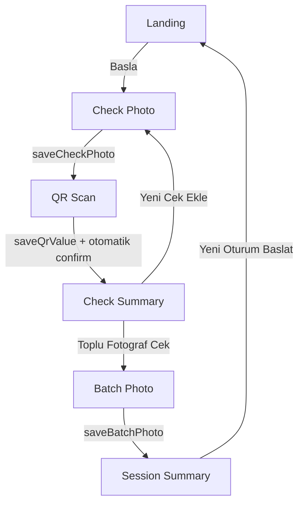
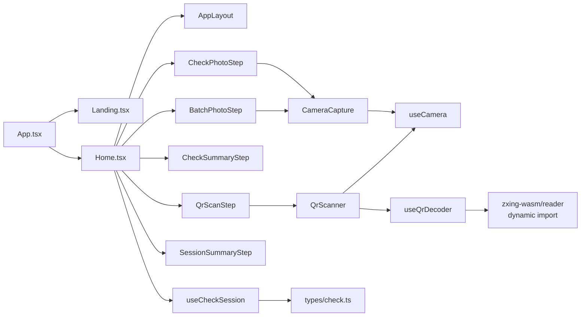
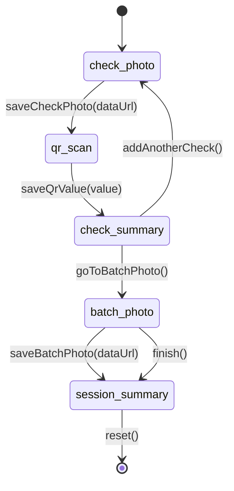

# QR Scanner UI - Cek Tarama Sistemi

Bu proje, cek toplama akisinin mobil uyumlu bir web arayuzudur.
Kullanici sirasiyla cek fotografini ceker, cek uzerindeki QR/DataMatrix kodunu okutur, birden fazla ceki oturumda toplar, en sonda toplu fotograf ceker ve tum oturumu ozet ekraninda gorur.

Uygulama su an **frontend-only** calisir. Backend gonderimi henuz yoktur.

## Icerik
- [Genel Ozellikler](#genel-ozellikler)
- [Ekranlar ve Uctan Uca Akis](#ekranlar-ve-uctan-uca-akis)
- [Mimari Diyagramlar](#mimari-diyagramlar)
- [Teknik Yapi](#teknik-yapi)
- [State Yonetimi (useCheckSession)](#state-yonetimi-usechecksession)
- [Kamera ve QR Okuma](#kamera-ve-qr-okuma)
- [Proje Dizini](#proje-dizini)
- [Kurulum ve Calistirma](#kurulum-ve-calistirma)
- [iOS / HTTPS Notlari](#ios--https-notlari)
- [Hata Senaryolari ve Davranislar](#hata-senaryolari-ve-davranislar)
- [Gelistirme Notlari](#gelistirme-notlari)

## Genel Ozellikler
- Landing ekrani: logo/fallback logo + "Basla".
- Cek fotografi cekme (kamera canli goruntu + cek hizalama overlay'i).
- QR/DataMatrix tarama (WASM ile, lazy-load).
- Cek bazli ozet (eklenen cekin goruntusu + QR metni).
- Coklu cek toplama (Yeni Cek Ekle dongusu).
- Toplu fotograf cekme (bu adimda overlay kapali).
- Oturum ozeti (toplu goruntu + tum ceklerin listesi).
- Reset ile Landing ekranina donus.

## Ekranlar ve Uctan Uca Akis
1. **Landing**
1. **Cek Fotograf Cek**
1. **QR Tara**
1. **Cek Tamamlandi**
1. (**Istege bagli dongu**) Yeni Cek Ekle -> tekrar Cek Fotograf
1. **Toplu Fotograf**
1. **Tarama Tamamlandi / Oturum Ozeti**
1. **Yeni Oturum Baslat** -> Landing



## Mimari Diyagramlar

### 1) Uygulama Bilesen Iliskileri


### 2) Check Session State Makinesi


## Teknik Yapi
- **Framework**: React 18 + TypeScript (strict)
- **Build Tool**: Vite 5
- **Styling**: Tailwind CSS
- **QR Decode**: `zxing-wasm`
- **State Management**: `useState`, `useReducer` (harici state kutuphanesi yok)
- **Mimari Kurali**:
  - Hooklar: `src/hooks/`
  - Bilesenler: `src/components/`
  - Sayfalar: `src/pages/`
  - Tipler: `src/types/`

## State Yonetimi (useCheckSession)
Dosya: `src/hooks/useCheckSession.ts`

Merkezi oturum state'i:

```ts
interface CapturedCheck {
  id: string
  photoDataUrl: string
  qrValue: string
}

interface CheckSession {
  checks: CapturedCheck[]
  batchPhotoDataUrl: string | null
}

type CheckCaptureStep =
  | 'check-photo'
  | 'qr-scan'
  | 'check-summary'
  | 'batch-photo'
  | 'session-summary'
```

Onemli davranislar:
- `saveCheckPhoto` -> adim `qr-scan`
- `saveQrValue` -> cek otomatik tamamlanir, adim `check-summary`
- `addAnotherCheck` -> yeni `id` uretilir (`crypto.randomUUID()`), adim `check-photo`
- `goToBatchPhoto` -> adim `batch-photo`
- `saveBatchPhoto` -> adim `session-summary`
- `reset` -> tum state sifirlanir

## Kamera ve QR Okuma

### Kamera (useCamera)
Dosya: `src/hooks/useCamera.ts`

- `navigator.mediaDevices.getUserMedia` kullanilir.
- Constraint:
  - `facingMode: { ideal: 'environment' }`
  - `width: { ideal: 1920 }`
  - `height: { ideal: 1080 }`
- iOS'ta HTTPS zorunlulugu kontrol edilir (`window.isSecureContext`).
- Hata mesajalari kullanici dostu sekilde normalize edilir.
- Hook unmount oldugunda kamera stream'i durdurulur.

### Fotograf cekme (CameraCapture)
Dosya: `src/components/CameraCapture/CameraCapture.tsx`

- `video` uzerinden canli akisi gosterir.
- Gizli `canvas` ile frame alir.
- `canvas.toDataURL('image/jpeg', 0.85)` uretir.
- `onCapture(dataUrl)` callback'iyle ust seviyeye verir.
- `showOverlay` ile cek hizalama overlay'i ac/kapat:
  - `CheckPhotoStep`: acik
  - `BatchPhotoStep`: kapali

### QR decode (useQrDecoder + QrScanner)
Dosyalar:
- `src/hooks/useQrDecoder.ts`
- `src/components/QrScanner/QrScanner.tsx`

- `requestAnimationFrame` dongusuyle video frame'leri okunur.
- Her frame'de `canvas.getImageData(...)` alinip decode edilir.
- **Lazy-load**:
  - `import('zxing-wasm/reader')` sadece decode aninda yuklenir.
- Formatlar:
  - `DataMatrix`
  - `QRCode`
- Algilanan ilk kodda dongu durur ve `onResult` tetiklenir.

## Proje Dizini

```text
qr-scanner-ui/
  src/
    components/
      AppLayout/
      CameraCapture/
      CheckCapture/
        CheckPhotoStep.tsx
        QrScanStep.tsx
        CheckSummaryStep.tsx
        BatchPhotoStep.tsx
        SessionSummaryStep.tsx
      QrScanner/
    hooks/
      useCamera.ts
      useQrDecoder.ts
      useCheckSession.ts
    pages/
      Landing.tsx
      Home.tsx
    types/
      check.ts
    utils/
      zxingTest.ts
    App.tsx
    main.tsx
```

## Kurulum ve Calistirma

### Gereksinimler
- Node.js 18+
- npm 9+

### Komutlar
```bash
npm install
npm run dev
npm run build
npm run preview
npm run lint
```

### Calisma Sirasinda
- Varsayilan gelistirme adresi: `http://127.0.0.1:5173`
- Kamera icin mobil Safari tarafinda HTTPS gerekeceginden, sadece localhost yerine SSL proxy ihtiyaci olabilir.

## iOS / HTTPS Notlari
Kamera izinlerinin Safari/iOS tarafinda duzgun calismasi icin guvenli baglam gerekir.

Projede yardimci dosyalar mevcut:
- `setup-ssl.sh`: self-signed sertifika uretir (`ssl/cert.pem`, `ssl/key.pem`)
- `nginx-dev-ssl.conf`: Vite dev server'ina SSL reverse proxy

Ornek akis:
```bash
./setup-ssl.sh
npm run dev
sudo nginx -c /home/alphan/Desktop/Deamon-ui/qr-scanner-ui/nginx-dev-ssl.conf -g 'daemon off;'
```

Sonra yerel agdan HTTPS ile acilir.

Not:
- `setup-ssl.sh` cikti mesaji icinde eski `/qr-demo` path'i gorulebilir.
- Guncel uygulama akisi root path (`/`) uzerinden calisir.

## Hata Senaryolari ve Davranislar
- **Kamera izni reddedildi**: Acik mesaj gosterilir.
- **Kamera bulunamadi / mesgul**: Acik mesaj gosterilir.
- **Kamera hazir degilken cekim**: Kullaniciya hata mesaji verilir.
- **QR decode hatasi**: Konsola loglanir, dongu bir sonraki frame ile devam eder.
- **Eksik check ozeti**: Home fallback uyari karti gosterir ve "Yeni Cek Ekle" ile toparlanir.

## Gelistirme Notlari
- Uygulama `App.tsx` acilisinda `runZxingSmokeTest()` calistirir.
  - Amac: `zxing-wasm` modulu yuklenebiliyor mu erken dogrulamak.
- Kod tabani strict TypeScript kurallariyla yazilmistir.
- UI tarafinda adimlara gore tek bir merkezi orkestrasyon (`Home.tsx`) bulunur.
- `SessionSummaryStep` adiminda `AppLayout` yerine ozel tam ekran layout kullanilir.

## Gelecek Iyilestirme Alanlari
- Backend gonderim adimi (SessionSummary altinda "Gonder" aksiyonu)
- Captured check verisini sunucuya stream veya batch ile aktarma
- Daha guclu hata raporlama ve telemetry
- Oturum verisini gecici local persistence (istege bagli)

---

Bu README, projenin mevcut halini referans alir ve kod ile birebir uyumlu olacak sekilde hazirlanmistir.
